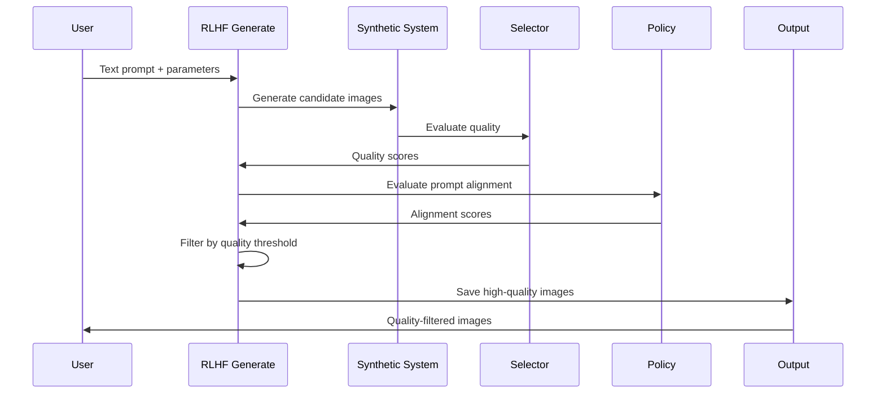

## CS787 Course Project

This is a sophisticated AI system designed to generate high-quality synthetic medical images from text descriptions. 

It's a diffusion-based text-to-medical-image generative model capable of synthesizing high-quality, multi-modal medical images conditioned on natural language prompts and modality specifications.

Supports multiple medical imaging modalities including OCT (ophthalmology), Fundus (retinal), Chest X-ray, Chest CT, Brain MRI, and Breast MRI.

## System Architecture

### Training Architecture

The training system implements a **two-stage Reinforcement Learning from Human Feedback (RLHF)** pipeline that optimizes medical image generation quality through expert ratings and automated quality assessment.


### Generation Architecture

The generation system provides **two distinct approaches**: baseline generation using vanilla Stable Diffusion and RLHF-enhanced generation using trained quality control models.


### Generation Workflows

#### Baseline Generation Flow


#### RLHF Generation Flow


## Data Format

### Dataset Structure
The system expects a single CSV file with three columns: `path`, `Text`, and `modality`.

```csv
path,Text,modality
datasets/oct/retina_healthy.png,OCT: healthy retinal layers with clear foveal depression,OCT
datasets/ct/chest_normal.dcm,Chest CT: normal lung parenchyma without nodules,CT
datasets/mri/brain_tumor.nii.gz,Brain MRI: enhancing mass in right temporal lobe,MRI
datasets/xray/chest_pneumonia.jpg,Chest X-ray: bilateral infiltrates consistent with pneumonia,X-Ray
datasets/fundus/diabetic_retinopathy.png,Fundus: microaneurysms and hard exudates in diabetic patient,Fundus
datasets/mri/breast_lesion.png,Breast MRI: irregular enhancing mass in upper outer quadrant,MRI
```

### Supported Modalities
- **OCT** (Optical Coherence Tomography): Retinal imaging for ophthalmology
- **CT** (Computed Tomography): Cross-sectional imaging (chest, abdomen, brain)
- **X-Ray**: 2D radiographic imaging
- **MRI** (Magnetic Resonance Imaging): Multi-planar imaging (brain, breast, spine)
- **Fundus**: Retinal photography for eye examination

### Image Format Support
- **Standard formats**: PNG, JPG, JPEG
- **Medical formats**: DICOM (.dcm), NIfTI (.nii, .nii.gz)
- **Resolution**: Configurable (default: 256x256)
- **Channels**: Grayscale (L) or RGB

### Dataset Organization
```
datasets/
├── oct/           # Optical Coherence Tomography
│   ├── healthy/
│   ├── diabetic_retinopathy/
│   └── macular_degeneration/
├── ct/            # Computed Tomography
│   ├── chest/
│   ├── abdomen/
│   └── brain/
├── mri/           # Magnetic Resonance Imaging
│   ├── brain/
│   ├── breast/
│   └── spine/
├── xray/          # X-Ray imaging
│   ├── chest/
│   ├── abdomen/
│   └── extremities/
├── fundus/        # Fundus photography
│   ├── normal/
│   ├── diabetic/
│   └── hypertensive/
└── metadata.csv   # Main dataset file
```

### Text Prompt Guidelines
- **Format**: `{Modality}: {detailed description}`
- **Be specific**: Include anatomical location, pathology, image characteristics
- **Use medical terminology**: Leverage standard radiological descriptions
- **Examples**:
  - `OCT: healthy retinal layers with clear foveal depression and normal choroidal vasculature`
  - `CT: chest scan showing bilateral ground glass opacities in lower lobes`
  - `MRI: T1-weighted brain image with enhancing mass in right temporal lobe`

## Installation

### Prerequisites
- **Python management (uv)**: fast package/dependency manager/runner
- **Training launcher**: Accelerate (multi-device, mixed precision)
- **DL libs**: PyTorch, Diffusers, Transformers
- **Eval**: clean-fid/torchvision metrics, scikit-image
- **Lint/format**: ruff

### Basic Installation

1. Install uv
   - macOS/Linux:
   ```bash
   curl -LsSf https://astral.sh/uv/install.sh | sh
   ```
   - Windows (PowerShell):
   ```powershell
   powershell -c "irm https://astral.sh/uv/install.ps1 | iex"
   ```

2. Create/activate a virtualenv and install project in editable mode with dev tools:
```bash
uv venv
uv pip install -e .
```

If you see an error like `module 'torch.library' has no attribute 'custom_op'`, pin diffusers to 0.30.0 (compatible with torch 2.3):

```bash
uv pip install --force-reinstall "diffusers==0.30.0"
```

3. Optional (recommended on 12GB GPUs): enable 8-bit Adam (CUDA 11.8 wheel)
```bash
uv pip install 'bitsandbytes==0.41.1'
# or use optional extra: uv pip install -e .[bnb]
# If uv tries to pull cu12 provider packages, pin and build from source (CUDA 11.8):
CMAKE_ARGS="-DCUDA_ARCHITECTURES=61" CUDA_VERSION=118 BNB_CUDA_VERSION=118 \
  uv pip install --no-binary bitsandbytes 'bitsandbytes==0.41.1'
```

4. Format code and run lints:
```bash
uv run ruff format .
```

### CUDA 11.8 GPU Installation

The repository is configured for Python 3.11. For CUDA 11.8 GPU execution on a remote with dependency constraints, follow these steps.

#### Verify NVIDIA stack
```bash
nvcc --version
nvidia-smi
```

#### Install project with CUDA 11.8-compatible PyTorch

`pyproject.toml` pins a Pascal-friendly stack for CUDA 11.8 (tested on TITAN Xp):
- torch 2.1.2 + cu118, torchvision 0.16.2 + cu118
- diffusers 0.27.2, transformers 4.38.2, tokenizers 0.15.2
- huggingface-hub 0.25.2, numpy < 2.0

Install:
```bash
uv venv
# Install PyTorch with CUDA 11.8 support first
uv pip install torch==2.1.2 torchvision==0.16.2 --index-url https://download.pytorch.org/whl/cu118
# Then install the rest of the project (this will use the CUDA 11.8 PyTorch)
uv pip install -e .
```

#### GPU sanity checks
```bash
source .venv/bin/activate
python - << 'EOF'
import torch
print("CUDA available:", torch.cuda.is_available())
print("CUDA device count:", torch.cuda.device_count())
print("Device 0:", torch.cuda.get_device_name(0) if torch.cuda.is_available() else None)
EOF
```

### System Specifications
- **Platform**: Linux 4.15.0-194-generic (x86_64)
- **Python**: 3.11.13
- **CPU**: 16 physical / 32 logical cores @ 813 MHz
- **RAM**: 46.81 GB (43.46 GB available)
- **Storage**: 250.92 GB total, 80.26 GB free
- **GPU 0**: NVIDIA TITAN Xp (12GB VRAM)
- **GPU 1**: NVIDIA TITAN Xp (12GB VRAM)

### Multi-GPU Support
The system supports both single and multi-GPU configurations:
- **Single GPU**: Use `CUDA_VISIBLE_DEVICES="0"` or `CUDA_VISIBLE_DEVICES="1"`
- **Multi-GPU**: Use `CUDA_VISIBLE_DEVICES="0,1"` for both GPUs
- **Auto-detection**: Scripts automatically detect available GPUs and adjust batch sizes
- **Device selection**: Use `--device auto`, `--device cuda:0`, or `--device cuda:1`

## Commands

### One-command End-to-End Pipeline (Fine-tuning → RLHF → Generate)

To run the complete pipeline that fine-tunes the Stable Diffusion UNet, trains the RLHF policy/selector, and generates images with the fine-tuned model:

```bash
bash start.sh
```

Environment overrides (optional, CUDA 11.8 safe defaults baked in):

```bash
# Example: use GPU 1, offline mode, allocator tuning, 8-bit Adam
CUDA_VISIBLE_DEVICES=1 \
AUTOPICK_GPU=0 \
HF_HUB_OFFLINE=1 TRANSFORMERS_OFFLINE=1 \
PYTORCH_CUDA_ALLOC_CONF="max_split_size_mb:64" \
USE_8BIT_ADAM=1 \
BASE_PROMPT="Brain MRI: T1-weighted image showing normal anatomy" \
NUM_IMAGES=4 \
E2E_OUTPUT_DIR=generated_e2e_mri \
bash start.sh
```

Defaults used by the script (kept simple for 12GB VRAM):
- **GPU selection**: auto-picks the least-loaded single GPU, overrides to `CUDA_VISIBLE_DEVICES=<id>` to pin
- **Batch/accumulation**: `TRAIN_BATCH_SIZE=1`, `GRADIENT_ACCUMULATION_STEPS=32`
- **Resolution**: `RESOLUTION=128` (very low VRAM footprint)
- **xFormers**: disabled by default (`ENABLE_XFORMERS=0`); enable with `ENABLE_XFORMERS=1` if installed
- **EMA**: disabled by default (`USE_EMA=0`)
- **UNet output**: `./checkpoints/medical-model`
- **RLHF config**: `./config.yaml`
- **Prompt**: `Chest X-ray: normal lung fields without infiltrates`
- **Images**: `3`
- **Output dir**: `generated_e2e/finetuned`

### Generate with the fine-tuned pipeline (after start.sh)

```bash
# Use the final fine-tuned UNet (or any intermediate checkpoint like checkpoint-1000)
UV_NO_SYNC=1 HF_HUB_OFFLINE=1 TRANSFORMERS_OFFLINE=1 \
PYTORCH_CUDA_ALLOC_CONF="max_split_size_mb:64" \
uv run python generate.py \
  --pretrained_model runwayml/stable-diffusion-v1-5 \
  --model_used ./checkpoints/medical-model \
  --prompt "Chest X-ray: normal lung fields without infiltrates" \
  --device cuda:1 \
  --precision float32 \
  --img_num 3 \
  --num_inference_steps 50 \
  --output_dir generated_e2e/finetuned
```

### Baseline Generation (No Training Required)

```bash
# Generate chest X-rays
UV_NO_SYNC=1 uv run python generate.py --use_pretrained_only --prompt "Chest X-ray: normal lung fields without infiltrates" --img_num 3 --device cpu

# Generate brain MRI
UV_NO_SYNC=1 uv run python generate.py --use_pretrained_only --prompt "Brain MRI: T1-weighted image showing normal anatomy" --img_num 2 --device cpu

# Generate fundus images
UV_NO_SYNC=1 uv run python generate.py --use_pretrained_only --prompt "Fundus: healthy retina with clear optic disc" --img_num 1 --device cpu
```

### Individual Training Components

#### Fine-tune Stable Diffusion UNet
```bash
cd scripts
bash train.sh
```

#### RLHF Training (policy + selector)
```bash
UV_NO_SYNC=1 uv run python main.py
```

## Training Details

### Training Stages

#### Stage 1: Foundation Training
- **Objective**: Train both Selector and Policy models using all available data
- **Selector Learning**: Discriminate between high-quality (rating 2-3) and low-quality (rating 1) medical images
- **Policy Learning**: Learn optimal prompt-image alignment using expert ratings
- **Duration**: Configurable epochs (default: 100)

#### Stage 2: Quality-Filtered Training
- **Objective**: Use trained Selector to filter low-quality images, then train Policy on filtered high-quality data
- **Selector Threshold**: Configurable quality threshold (default: 0.6)
- **Policy Refinement**: Focus on high-quality samples for better alignment learning
- **Iterative Improvement**: Continuous refinement of both models

### Training Components

#### 1. Synthetic System
- **Base Model**: Stable Diffusion v1.5 with medical domain adaptation
- **Training Mode**: Optional fine-tuning during RLHF (disabled by default)
- **Image Generation**: 256x256 resolution, configurable inference steps and guidance scale

#### 2. Selector Model
- **Architecture**: Vision Transformer (ViT) with medical quality metrics
- **Input**: Medical images (grayscale, normalized)
- **Output**: Quality score (0-1 range)
- **Quality Metrics**: SNR, contrast, artifact detection
- **Training**: Binary classification with expert rating supervision

#### 3. Policy Model
- **Architecture**: Vision Transformer + CLIP fusion network
- **Input**: Medical images + text prompts
- **Output**: Alignment score (0-1 range)
- **Training**: RLHF with advantage-based policy gradient
- **Loss Function**: Custom advantage-weighted log probability

#### 4. Rating System
- **Data Source**: CSV with columns: `image_path`, `rating`, `modality`, `expert_level`, `prompt`
- **Rating Scale**: 1-3 scale (1: poor, 2: acceptable, 3: excellent)
- **Expert Weighting**: Optional expert level weighting for training
- **Batch Processing**: Configurable batch sizes for training

### Training Configuration

The training system is configured through `config.yaml`:

```yaml
training:
  stage: 2                    # Training stage (1 or 2)
  max_epochs: 100            # Maximum training epochs
  batch_size: 32             # Training batch size
  stage1:
    learning_rate: 0.0001    # Stage 1 learning rate
    train_selector: true     # Train selector in stage 1
  stage2:
    learning_rate: 0.0001    # Stage 2 learning rate
    selector_threshold: 0.2  # Quality threshold for filtering
  checkpoints:
    save_dir: "checkpoints"  # Checkpoint directory
    save_frequency: 10       # Save every N epochs
```

### Training Outputs

#### Checkpoints
```
checkpoints/
├── [timestamp]/
│   ├── epoch_10/
│   │   ├── policy_checkpoint.pt
│   │   ├── selector_checkpoint.pt
│   │   └── synthetic_checkpoint.pt
│   ├── epoch_20/
│   └── ...
```

#### Training Metrics
- **Policy Loss**: RLHF policy optimization loss
- **Selector Loss**: Quality assessment training loss
- **Pass Rate**: Percentage of images passing quality threshold
- **Learning Rates**: Current learning rates for all models
- **Synthetic Loss**: Optional synthetic system fine-tuning loss

## Generation Details

### Generation Modes

#### 1. Baseline Generation (No Training Required)
- **Purpose**: Quick medical image generation without quality control
- **Use Case**: Prototyping, testing, baseline comparisons
- **Model**: Vanilla Stable Diffusion v1.5
- **Output**: Raw generated images

#### 2. RLHF-Enhanced Generation (After Training)
- **Purpose**: High-quality medical image generation with automated quality control
- **Use Case**: Production use, clinical applications, research
- **Models**: Trained Selector + Policy + Synthetic System
- **Output**: Quality-filtered, prompt-aligned medical images

### Generation Parameters

#### Common Parameters
- **Prompt**: Medical description with modality specification
- **Number of Images**: How many images to generate
- **Device**: CPU/GPU selection
- **Inference Steps**: Number of denoising steps (higher = better quality, slower)

#### RLHF-Specific Parameters
- **Quality Threshold**: Minimum selector score for acceptance
- **Policy Checkpoint**: Path to trained policy model
- **Modality**: Medical imaging modality for specialized processing

### Output Management

#### File Naming Convention
```
generated_images/
├── chest_xray_0.png
├── chest_xray_1.png
├── chest_xray_2.png
└── ...

generated_rlhf/
├── Brain_MRI_1_selector_0.85_policy_0.92.png
├── Brain_MRI_2_selector_0.78_policy_0.89.png
└── ...
```

#### Quality Metrics
- **Selector Score**: Image quality assessment (0-1)
- **Policy Score**: Prompt-image alignment (0-1)
- **Generation Attempts**: Number of attempts to meet quality threshold

### Generation Best Practices

#### Prompt Engineering
- **Be Specific**: Include anatomical location and pathology details
- **Use Medical Terminology**: Leverage standard radiological descriptions
- **Modality Specification**: Always specify imaging modality
- **Example**: `"Chest CT: bilateral ground glass opacities in lower lobes with peripheral sparing"`

#### Quality Optimization
- **Inference Steps**: Use 50-100 steps for medical images
- **Guidance Scale**: 7.5-15 for strong prompt adherence
- **Batch Size**: Generate multiple candidates and select best
- **Post-processing**: Apply medical image normalization if needed

#### Resource Management
- **GPU Memory**: Monitor VRAM usage for large models
- **CPU Fallback**: Use CPU for development/testing
- **Batch Processing**: Process multiple prompts efficiently
- **Checkpoint Loading**: Load models once, generate multiple images

# References 

* [Self-improving generative foundation model for synthetic medical image generation and clinical applications](https://www.nature.com/articles/s41591-024-03359-y)
* [MINIM](https://github.com/WithStomach/MINIM)
* [PubMedBERT](https://arxiv.org/pdf/2007.15779)