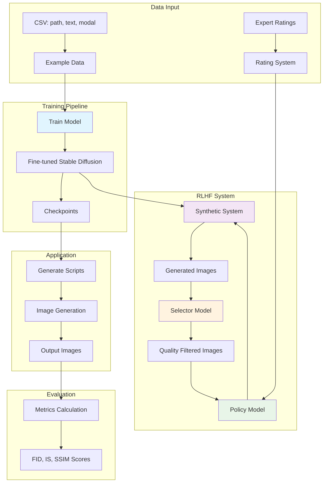

## CS787 Technical Report

1) If your project is based on a paper:

a) State that the paper is published in a reputed conference

b) Mention if you could download/clone the repository, browse and build the source code and dataset

c) Reproduce the results of the paper on a small subset of the dataset

d) How close is your reproduction to what the authors reported in the paper?

### Scope
Generate synthetic medical images based on textual descriptions and specified imaging modality (e.g., "breast with tumor, MRI"; "lung with pneumonia, chest X-ray").

Support for image generation across various imaging modalities:

* Optical Coherence Tomography (OCT)
* Fundus
* Chest X-ray
* Chest Computed Tomography (CT)
* Brain MRI

Further extensible to new modalities and prompts. We follow a Multi-Stage Training approach: initially we train on all data, Selector model filters low-quality outputs, RLHF pipeline for ongoing optimization.

### Implementation Status
The system now provides two main usage modes:

1. **Pre-trained Model Usage**: Immediate image generation using `simple_generate.py` without any training required
2. **Custom Training**: Fine-tune models on medical datasets using the training pipeline

### Possible improvements over existing implementation

The existing MINIM is quite basic - it's essentially a fine-tuned Stable Diffusion model with minimal medical domain adaptations. Some possible improvements :

- Basic cross-attention with general-domain BERT tokenizer lacks medical vocabulary specificity and spatial reasoning capabilities. Replace with medical-domain pre-trained transformers and enhanced attention mechanisms. Implementing PubMedBERT (consistently outperforms standard BERT by 5-10% on medical tasks, achieving F1-scores of 88.8% vs BERT's 83.9% and contains 28,000+ medical-specific tokens compared to BERT's general vocabulary) or ClinicalBERT would provide substantial improvements in medical terminology understanding. These models are pre-trained on millions of medical texts, offering better semantic representations for clinical concepts like "bilateral infiltrates" or "contrast enhancement patterns". The medical vocabulary coverage is significantly higher—PubMedBERT contains specialized tokens for anatomical structures, pathological findings, and imaging characteristics that general BERT models lack.
- Adding transformer blocks within U-Net layers creates spatial-textual feature alignment at multiple resolution scales, capturing long-range anatomical dependencies that current MINIM misses. Unlike basic cross-attention that operates at fixed resolutions, integrating self-attention within encoder/decoder blocks enables the model to capture long-range spatial dependencies crucial for anatomical coherence. This architecture allows features at 64×64 resolution to attend to both local tissue patterns and global anatomical context simultaneously.
- Pyramid Medical Transformer (PMTrans) achieves superior performance by processing multiple resolutions simultaneously - [Paper](https://arxiv.org/pdf/2104.14702)
- Standard skip connections can be enhanced with attention-gated mechanisms that selectively emphasize clinically relevant features. For medical images, certain anatomical landmarks (heart borders, organ boundaries) require higher preservation than background regions. Attention gates learn to weight skip connections based on clinical importance, improving anatomical consistency across generated images. - [Paper](https://pubmed.ncbi.nlm.nih.gov/37896682/)
- Medical images contain features at vastly different scales—from cellular structures to entire organ systems. Implementing Feature Pyramid Networks (FPN) within the U-Net allows simultaneous processing of fine pathological details and gross anatomical structures. This is particularly crucial for modalities like histopathology or retinal imaging where microscopic and macroscopic features must be coherently generated. - [Paper](https://pubmed.ncbi.nlm.nih.gov/36042149/)
- Optional - Maybe instead of direct "modality + description" input, implement a multi-stage reasoning process - Anatomical Localization: "Identify the chest region and lung fields", Pathology Assessment: "Detect signs of consolidation in the right lower lobe", and then Visual Feature Mapping: "Generate corresponding opacity patterns with air bronchograms". Implement clinical reporting templates that guide generation through standard radiological interpretation frameworks like "History → Technique → Findings → Impression." This structured approach ensures generated images align with established medical imaging protocols. - [Paper](https://arxiv.org/abs/2506.10465)
- Optional - Implementing [LightRAG](https://lightrag.github.io/) with medical databases (RadLex, SNOMED-CT, medical literature) enables dynamic retrieval of relevant case studies during generation. When generating "pneumonia chest X-ray," the system retrieves similar confirmed cases, anatomical references, and established imaging patterns to guide synthesis. This approach significantly improves clinical plausibility by grounding generation in validated medical knowledge. - [Paper](https://academic.oup.com/bioinformatics/article/40/Supplement_1/i119/7700892?login=true), [Paper](https://arxiv.org/pdf/2402.13178)
- Extend the current Policy, Selector, and Synthetic System in RLHF with medical domain capabilities (PubMedBERT tokenizers, clinical reasoning modules, enhanced U-Net with attention gates) while preserving the proven two-stage training pipeline, expert rating integration, and checkpoint management systems. - [Paper](https://pmc.ncbi.nlm.nih.gov/articles/PMC9344209/)
- Optional - Deploy specialized medical AI agents for generated image verification. Agents can provide structured feedback for automated refinement: "Generated chest X-ray shows heart size inconsistent with described cardiomegaly—increase cardiac silhouette by 15%." This creates a self-improving system that continuously enhances clinical accuracy without human intervention.

This approach mirrors clinical decision-making and produces more diagnostically accurate images. The intermediate steps provide interpretable checkpoints for quality validation and enable targeted improvements during training.

### High Level Architecture

- Uses CSV format and loads paired image-text-modal [path, text, modal] data. Loads and pre-processes images to standard resolution 256×256 with aspect ratio preservation. Normalize to [-1, 1] for diffusion model compatibility. Work on .png and .jpg formats. Maybe some batch processing? Load data in chunks rather than entire dataset in memory to handle large CSV files without memory overflow?
- Tokenizer will convert textual prompts ("modality, finding, organ") into token IDs and attention masks. We can use some medical-domain transformer tokenizer (e.g., PubMedBERT - smaller vocabulary, faster processing) which would handle both modality tokens (MRI, CT, etc.) and rich description tokens supporting prompt templates for data augmentation, instead of standard CLIP tokenizer. Implement prompt augmentation for training robustness.
- Text-condition encoder (Transformer) would embed tokenized prompts to provide text conditioning for the generator (Token IDs → embeddings). Right now, a simple pre-trained CLIP text encoder is used. Pre-trained transformer encoder (BioBERT, ClinicalBERT, etc) outputs sequence of embeddings (per token) for cross-attension and pooled embedding (whole sequence) for global conditioning
- Maybe we can have a Modality Encoder (Modality → embedding, fusion with text) explicitly embeds imaging modality for conditioning or element-wise fusion (Hadamard product + linear projection). We would get Transform combined embeddings for U-Net consumption. Right now we have just string concatenation. Just concatenating "modality: description" lacks clinical reasoning
- We would use a U-Net architecture (encoder-decoder with attension-gated skip connections) as main generator (image noise reversal), that handles progressive noise addition and removal and supports mixed-precision (fp16 for forward pass and fp32 for gradient computation) for efficiency. Right now we have a pre-trained Stable Diffusion U-Net.
- Next, we would use cross-attension blocks to merge text (and modality) features with image features at each U-Net stage
- Also, we can apply QLoRA to cross-attention layers, self-attention in middle blocks, and final output layers. Right now it's just standard fine tuning.
- We would use Classifier-Free Guidance (CFG) for adjustable strength of prompt adherence, Negative Prompting to suppress unwanted features, and Support for unconditional/conditional sampling and dynamic CFG scaling. Now, we would have end-to-end model accepting text+modality input, producing conditioned noise predictions
- We would use Stochastic noise scheduler (linear or cosine) with L2 loss for noise prediction. Might need some gradient clipping for preventing explosion of gradinents. Adds controlled Gaussian noise at each timestep to the image input and Trains U-Net to predict noise or x0 (clean image) per timestep. Generate images every N steps.
- For quantitative evaluation, we can use FID (Frechet Inception Distance) for per modality and overall, IS (Inception Score) to measure image quality and diversity, MS-SSIM for structural similarity assessment, CLIP Score for Text-image alignment measurement, etc
- 
---
