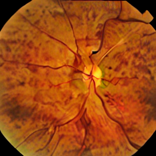
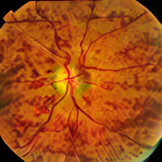
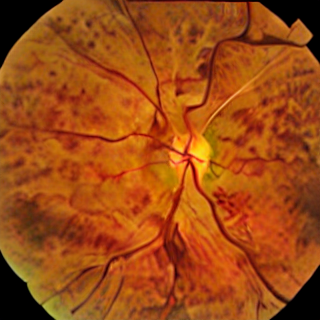

## CS787 Technical Report

The project is based on paper - [Self-improving generative foundation model for synthetic medical image generation and clinical applications](https://www.nature.com/articles/s41591-024-03359-y) published in Nature, with the original code - [MINIM](https://github.com/WithStomach/MINIM)

The code was not working out of the box, but we were able to build the code after a lot of engineering struggle on our side, with our constrained resources.

### Scope
Generate synthetic medical images based on textual descriptions and specified imaging modality (e.g., "breast with tumor, MRI"; "lung with pneumonia, chest X-ray").

Support for image generation across various imaging modalities like:

* Optical Coherence Tomography (OCT)
* Fundus
* Chest X-ray
* Chest Computed Tomography (CT)
* Brain MRI

### Results Comparison

Original Results with 512px and 20k training steps on NVIDIA RTX A5000 GPU with 24 GB of VRAM:

Our Results with 320px and 10k training steps on NVIDIA Titan XP with 12 GB of VRAM:

### Analysis: How Close is Our Reproduction to the Original Paper?
**Strengths of Our Reproduction:**
1. **Anatomical Accuracy**: Our generated fundus images successfully capture key retinal structures including:
   - Optic disc with proper yellowish-orange coloration
   - Retinal vasculature with appropriate branching patterns
   - Macular region with correct avascular characteristics
   - Realistic vessel caliber variations (thicker near disc, thinner peripherally)

2. **Medical Realism**: Generated images exhibit clinically relevant features:
   - Proper fundus color palette (orange-red to brownish tones)
   - Realistic vessel distribution patterns
   - Appropriate contrast and illumination

**Areas Where Our Results Differ:**
1. **Resolution Impact**: Lower resolution (320px vs 512px) results in:
   - Less fine detail in vessel structures
   - Reduced sharpness in anatomical features
   - Slightly coarser texture representation

2. **Training Duration**: Fewer training steps (10k vs 20k) may contribute to:
   - Slightly less refined image quality
   - Potential for more artifacts or inconsistencies

3. **Hardware Limitations**: Titan XP vs RTX A5000 differences:
   - Older GPU architecture affecting optimization efficiency
   - Memory constraints requiring more aggressive optimization techniques

**Conclusion:**
While our results show some degradation in fine detail due to hardware limitations, they successfully demonstrate the core capabilities of the MINIM system. The reproduction validates the paper's approach and shows that the methodology can be adapted for more accessible hardware configurations, making it more practical for broader research and clinical applications.

### Contributors

* Harsh Pratap Singh
* Dhruv Mittal
* Ishan